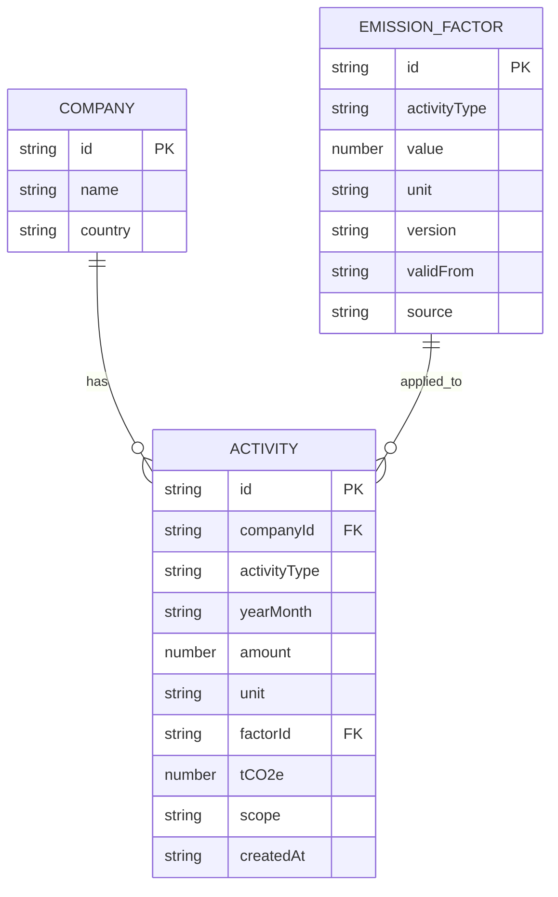

# Data Model: PCF Dashboard

**Feature**: 001-pcf-dashboard
**관련 문서**: `spec.md`, `plan.md`

본 문서는 `src/types/index.ts`로 그대로 옮겨질 도메인 모델의 단일 진실
공급원(Single Source of Truth)이다. 엔티티 5개를 정의하고, Scope 매핑 규칙과
시드 데이터를 함께 명시한다.

---

## 1. Company

회사 단위. CRUD 비대상이며 GET만 한다.

```ts
type Company = {
  id: string;
  name: string;
  country: string;  // ISO 3166-1 alpha-2 (예: "KR", "DE")
};
```

| 필드 | 타입 | 비고 |
|---|---|---|
| `id` | `string` | 시드 고정 (예: `c1`, `c2`) |
| `name` | `string` | 표시 이름 |
| `country` | `string` | 알파-2 코드 |

---

## 2. EmissionFactor

활동량을 `kgCO₂e`로 변환하는 계수. **버전 관리 대상**이다.

```ts
type EmissionFactor = {
  id: string;
  activityType: 'electricity' | 'plastic1' | 'plastic2' | 'transport';
  value: number;       // kgCO₂e per unit
  unit: string;        // 'kWh' | 'kg' | 'ton-km'
  version: string;     // 'v1', 'v0', ...
  validFrom: string;   // YYYY-MM
  source: string;      // 출처 (예: 'KEITI 2024', 'KEPCO 2025')
};
```

| 필드 | 타입 | 비고 |
|---|---|---|
| `id` | `string` | 활동 데이터의 `factorId`로 참조됨 |
| `activityType` | union | 활동 유형. Scope 매핑의 키 |
| `value` | `number` | 단위당 `kgCO₂e` |
| `unit` | `string` | `value`의 분모 단위 |
| `version` | `string` | `v1`이 현재, 과거는 `v0` 등으로 보존 |
| `validFrom` | `string` | 버전 적용 시작 월 |
| `source` | `string` | 인용 가능한 출처 |

**왜 버전을 갖는가** — 외부 기관이 배출계수를 갱신하면 `v2`가 추가되지만,
과거 활동 데이터의 계산값은 그 시점 적용 버전(`factorId`)을 그대로 참조해
재현성을 잃지 않는다. 이게 본 데이터 모델의 핵심 설계 결정 1번이다.

---

## 3. Activity

회사가 한 달 동안 한 활동(전기 사용·원소재 투입·운송) 한 건. PCF 계산값과
적용 계수를 모두 같은 행에 보존한다.

```ts
type ActivityType = 'electricity' | 'plastic1' | 'plastic2' | 'transport';
type Scope = 'scope1' | 'scope2' | 'scope3';

type Activity = {
  id: string;
  companyId: string;
  activityType: ActivityType;
  yearMonth: string;   // YYYY-MM
  amount: number;      // 활동량
  unit: string;        // 'kWh' | 'kg' | 'ton-km'
  factorId: string;    // 계산 시 적용한 EmissionFactor.id
  tCO2e: number;       // 계산 결과 (소수점 4자리 보존)
  scope: Scope;        // mapToScope(activityType) 결과
  createdAt: string;   // ISO 8601
};
```

| 필드 | 타입 | 비고 |
|---|---|---|
| `id` | `string` | 서버 또는 클라이언트 임시(`tmp-${Date.now()}`) |
| `companyId` | `string` | `Company.id` 참조 |
| `activityType` | union | Scope 매핑 키 |
| `yearMonth` | `string` | `YYYY-MM` 검증 필수 |
| `amount` | `number` | 0 이상. 음수는 검증 단계에서 거절 |
| `unit` | `string` | `EmissionFactor.unit`과 일치해야 함 |
| `factorId` | `string` | 계산 시점의 계수 버전을 고정 |
| `tCO2e` | `number` | `amount × factor.value ÷ 1000` |
| `scope` | union | `mapToScope` 결과를 캐싱해 UI 비용 절감 |
| `createdAt` | `string` | 감사추적은 생성일만 보존 |

POST는 15% 확률로 실패한다 → 클라이언트는 낙관적 업데이트 후 실패 시 롤백한다.

---

## 4. GhgEmission (집계 결과 타입)

차트와 KPI에서 사용하는 집계 결과 형태. DB 엔티티가 아니라 도메인 함수의 출력
shape이지만 타입은 한 곳에 둔다.

```ts
type GhgEmission = {
  yearMonth: string;
  source: ActivityType;
  tCO2e: number;
};
```

`aggregateByMonth(activities)` → `{ yearMonth, total }[]`
`aggregateBySource(activities)` → `{ source, total }[]`
`toStackedRows(activities)` → `{ yearMonth, electricity, plastic1, plastic2,
transport }[]` (Recharts 입력)

모든 집계 함수는 빈 배열 입력에 대해 빈 결과를 반환한다(에러 던지지 않음).

---

## 5. FilterState (UI 한정)

Zustand `useFilterStore`로만 관리한다. 영속화하지 않는다.

```ts
type FilterState = {
  companyId: string | 'all';
  from: string;  // YYYY-MM
  to: string;    // YYYY-MM
};
```

URL 동기화는 시간 여유가 있을 때 추가 (보너스 후보).

---

## 6. Scope 매핑 규칙 (코드 상수)

`src/lib/domain/scope.ts`에 단일 상수로 둔다. UI에서 추론하지 않는다.

```ts
const ACTIVITY_TO_SCOPE: Record<ActivityType, Scope> = {
  electricity: 'scope2',  // 외부 구매전력
  plastic1:    'scope3',  // 가치사슬 상류 — 원소재
  plastic2:    'scope3',
  transport:   'scope3',  // 가치사슬 하류 — 외부 물류
};

function mapToScope(activityType: ActivityType): Scope {
  return ACTIVITY_TO_SCOPE[activityType];
}
```

GHG Protocol 분류에 따른다 — 회사가 직접 연료를 태우는 활동(가솔린·LPG 등)이
없으므로 본 시드에는 Scope 1이 등장하지 않는다. 추후 활동 유형이 늘어나면 본
상수에만 추가하면 된다.

---

## 7. 시드 데이터

### 회사 (2개)

```ts
const companies: Company[] = [
  { id: 'c1', name: 'Acme Corp',  country: 'KR' },
  { id: 'c2', name: 'Globex GmbH', country: 'DE' },
];
```

### 배출계수 (4개 + v0 1개)

```ts
const factors: EmissionFactor[] = [
  { id: 'f-elec-v1', activityType: 'electricity',
    value: 0.4781, unit: 'kWh',    version: 'v1',
    validFrom: '2025-01', source: 'KEPCO 2025' },

  { id: 'f-p1-v1',   activityType: 'plastic1',
    value: 2.10,   unit: 'kg',     version: 'v1',
    validFrom: '2025-01', source: 'KEITI 2024' },

  { id: 'f-p1-v0',   activityType: 'plastic1',
    value: 2.05,   unit: 'kg',     version: 'v0',
    validFrom: '2024-01', source: 'KEITI 2023' },

  { id: 'f-p2-v1',   activityType: 'plastic2',
    value: 3.40,   unit: 'kg',     version: 'v1',
    validFrom: '2025-01', source: 'KEITI 2024' },

  { id: 'f-tr-v1',   activityType: 'transport',
    value: 0.105,  unit: 'ton-km', version: 'v1',
    validFrom: '2025-01', source: 'KEITI 2024' },
];
```

### 활동 데이터 (2회사 × 8개월 × 4유형 = 64행)

기간: `2025-01` ~ `2025-08`. 활동량은 회사·월·유형별로 자연스러운 변동을 갖도록
시드 함수에서 생성한다 (예: 전기 8,000~14,000 kWh, 플라스틱 200~600 kg, 운송
50~120 ton-km). 시드 생성 함수는 결정론적이어서 같은 입력에 같은 출력이 나온다.

각 행의 `tCO2e`는 시드 생성 시 `computeTCO2e`로 미리 계산해 보존한다 — 클라이언트
부팅 시 즉시 차트가 그려지도록.

---

## 8. 스키마 다이어그램 (Mermaid)



`Activity`가 `EmissionFactor`의 특정 버전(`factorId`)을 참조하는 점이 핵심이다.
계수가 갱신돼도 과거 행은 변하지 않는다.
